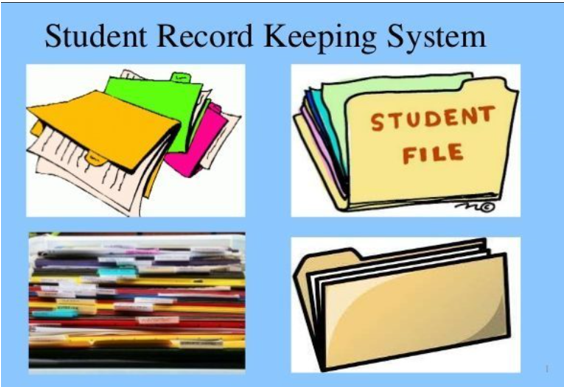

# Student Record Management System
Here you can find , how to manage large student data set and analyze to get the required records

## PROBLEM:
Imagine you are working at the “XYZ” school as a grade 10 section-head. You have all the student scorecards. I need to find answers to the following question. Write Python programs to get answers,
1. How many classes are there that have an above average 70 for science?
2. How many classes are there that have an above average 70 for literature?
3. What are the top 3 classes of grade 10? (based on student score average)
4. Who scored best in each grade 10 class? you have to print class and student ids of the best students
5. How many 1st places are there in grade 10 (section 1st places)?, print the student_ids.
Note:
All the student records are given as a json file.

## Record Keeping System Design Diagram

